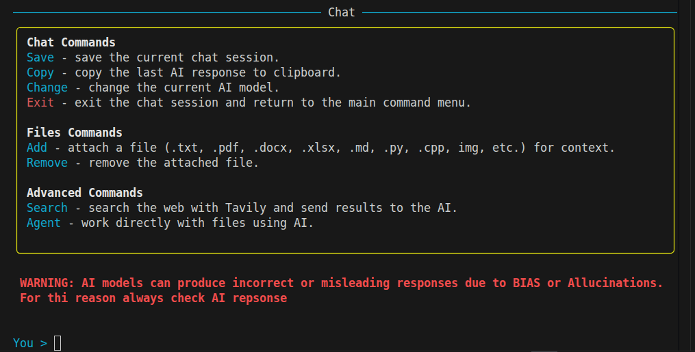
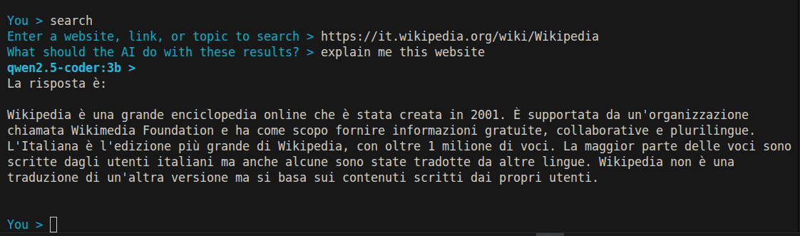
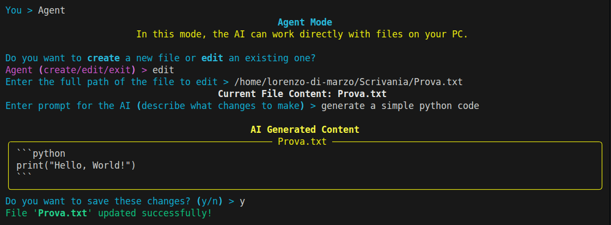

# MindCLI V2.0

<div align="center">
  
</div>

# ℹ️Repository Info


# 🎲 Features

| Images | Feature Description |
|------------|-------------------|
| <div align="center"></div> | **Ollama Compatibility:** Supports all Ollama AI models. From the CLI you can download, remove and control AI parameters like temperature, top_p, etc and the base prompt |
| <div align="center"></div> | **Privacy & Productivity:** Privacy-first app, all data remain on your PC and simultaneously improve your productivity |
| <div align="center"></div> | **Powerful Chat Mode:** MindCLI has a powerful chat mode with easy and useful commands and a text formatting that improve interaction with AI models and the advanced functions |
| <div align="center"></div> | **Search Function:** MindCLI has the search functions with Tavily that allow to search the web and get information from it and use it with AI |
| <div align="center"></div> | **Agent Function:** MindCLI has the Agent function that allow to create/edit a local file on your PC and use it with AI |
| <div align="center"></div> | **Other Functions:** Attach files for AI context, save chat history, AI memory for persistent info, PowerShell command integration |

# 📁Project Structure

```
MindCLI/
├── src/                               # Application source code
│   │
│   └── mindcli/                       # Main application package
│       ├── state.py                   # Global state, defaults, and console
│       ├── utils.py                   # Utility functions (clipboard, I/O, etc.)
│       ├── config_manager.py          # Configuration load/save
│       ├── ollama_utils.py            # Ollama process and AI generation
│       ├── file_handler.py            # File reading for attachments
│       ├── web_search.py              # Tavily search integration
│       ├── memory_manager.py          # Memory CRUD operations
│       ├── model_manager.py           # Model download, delete, list, switch
│       ├── chat_manager.py            # Chat loop, save, manage chat files
│       ├── ui.py                      # Terminal UI and command interface
│       ├── main.py                    # Application entry point
│       ├── assets/                    # Application assets (icons, etc.)
│       ├── chats/                     # Saved chat sessions
│       ├── cmd/                       # Windows command wrapper
│       ├── configs/                   # Configuration JSON files
│       └── models/                    # Per-model configuration files
│
├── docs/                              # Website source code
│   ├── index.html
│   ├── style.css
│   └── images/                        # Website images
│
├── MindCLI_UserGuide.pdf              # User guide
├── LICENSE.txt                        # GPL-3.0 License
├── README.md                          # Project overview
├── CHANGELOG.md                       # Version history
├── CONTRIBUTING.md                    # Contribution guidelines
├── pyproject.toml                     # Project metadata and build config
├── SECURITY.md                        # Security Policy
├── requirements.txt                   # Python dependencies
└── .gitattributes                     # Git repository settings
```

**About configs/assets:**  
Configuration files and assets are stored inside the application directory so they can be found when running from source or packaged as an EXE.

**About the docs/ folder:**  
The `docs/` folder contains files used for the source code of the website. It is **not required to run the application** locally.

**About the user guide:**  
The `MindCLI_UserGuide.pdf` file is a comprehensive user manual for the advanced functions and suggestions about the program.

# 💾Download MindCLI

To download MindCLI V2.0, follow the links below. The software is available for **Windows OS and Linux**:
- [Download MindCLI V2.0 for Windows](https://github.com/Lorydima/MindCLI/releases/download/MIndCLI_V2.0/MindCLI_V2.0_Windows.zip)
- [Download MindCLI V2.0 for Linux](https://github.com/Lorydima/MindCLI/releases/download/MIndCLI_V2.0/MIndCLI_V2.0_Linux.zip)

**For macOS**  
The `.app` file is not available.

However, the application can be run from source by executing the `main.py` file,
provided that Python and the required dependencies are installed.

# 🔗Clone Repository

Follow these steps:

```bash
git clone https://github.com/Lorydima/MindCLI.git
```

```bash
pip install -r requirements.txt
```

```bash
run src/main.py
```

All external libraries are listed in `requirements.txt`.

# 🛠️Bug reports and issue

I do my best to keep this project stable and reliable, but bugs can still happen.
If you spot any issues or errors, feel free to open a GitHub issue.
Your feedback really helps me improve the project.

Thanks for contributing and helping make this project better from *LDM Dev*❤️

# 📄License

Before you use the software please read the **GPL-3.0 License** license at this link: <a href="https://github.com/Lorydima/MindCLI?tab=License-1-ov-file#">License</a>
